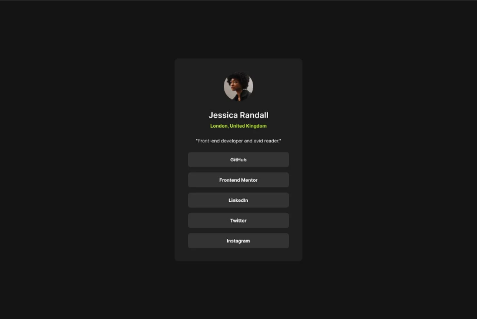

# Perfil Angular

Este é um repositório gerado com [Angular CLI](https://github.com/angular/angular-cli) na versão 19.1.7.

## Objetivo

* Criar uma aplicação Angular com a opção --no-standalone.
* Clonar a interface da imagem abaixo utilizando de flex container;



## Iniciando o projeto
Para iniciar um servidor de desenvolvimento, execute:

```bash
ng serve
```

Assim que o servidor estiver em execução, abra seu navegador e navegue até `http://localhost:4200/`.